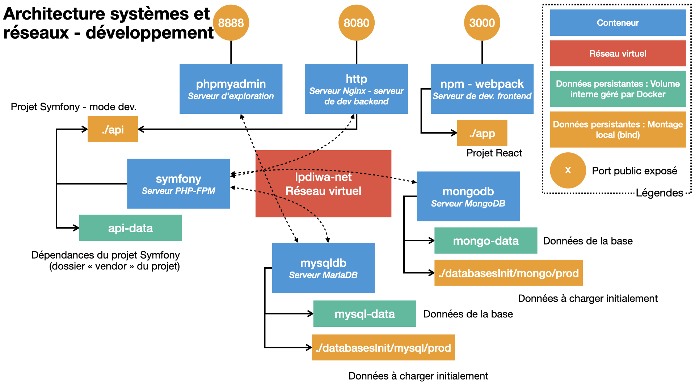

# Documentation - Infrastructure systèmes et réseaux - projet LP DIWA

*Auteur : Rémi Venant, <[remi.venant@univ-lemans.fr](mailto://remi.venant@univ-lemans.fr)>*  
*Version : 1.0*

Dans le cadre de votre projet, vous êtes amené à réaliser une application web repartie reposant sur différentes technologies :
- Les frameworks **React**, MobX pour la partie *frontend* ;
- Le framework PHP **Symfony** pour la partie *backend* ;
- Un serveur de base de données relationnelle **MariaDB** (équivalent MySQL) ;
- Un serveur de base de données NoSQL orientée Document **MongoDB**.

Pour faciliter le processus de développement et de déploiement de votre application,
une infrastructure logicielle reposant sur une pile de conteneurs **Docker** est mise à votre disposition,
ainsi qu'une **application de démonstration** exploitant la pile et les différentes technologies.

Ce document :
- décrit l'infrastructure pour le développement et celle pour la pré-production et la production ;
- décrit brievement la structure du dépôt git d'où est issue cette documentation ;
- fournie plusieurs commandes de base pour manipuler la pile.

## Prérequis

Ce projet s'appuie uniquement sur **Docker** et sur son outil de gestion automatisée **docker-compose**. Pour installer ces logiciels sur votre machine, veuillez suivre la procédure suivante, selon votre système d'exploitation.

### Installation de Docker (déjà présent sur les machines de l'IUT)

Système d'exploitation | Outil | Procédure d'installation
--- | --- | ---
Linux Debian | Docker | [https://docs.docker.com/engine/install/debian/](https://docs.docker.com/engine/install/debian/)
Linux Ubuntu | Docker | [https://docs.docker.com/engine/install/ubuntu/](https://docs.docker.com/engine/install/ubuntu/)
Linux (any distrib.) | docker-compose | [https://docs.docker.com/compose/install](https://docs.docker.com/compose/install) (choisir la rubrique Linux)
Windows | Docker & docker-compose | [https://docs.docker.com/docker-for-windows/install/](https://docs.docker.com/docker-for-windows/install/)
MacOS | Docker & docker-compose | [https://hub.docker.com/editions/community/docker-ce-desktop-mac/](https://hub.docker.com/editions/community/docker-ce-desktop-mac/)
Autre | Docker | [https://docs.docker.com/engine/install/](https://docs.docker.com/engine/install/)
Autre | docker-compose | [https://docs.docker.com/compose/install/](https://docs.docker.com/compose/install/)

### Préparation de Docker (pour Windows / Mac)
Pour pouvoir exploiter pleinement les fonctionnalités qu'offre Docker sur Windows ou macOS, il vous est nécessaire de vous authentifier sur docker hub (notamment pour télécharger des images).
- Lancez docker (Application "Docker Desktop" sur Windows ou macOS) ;
- Une fois lancé, ouvrir les réglages de l'application ;
- Authentifiez vous avec votre compte Docker (si vous n'en avez pas un, un formulaire de création vous sera proposé).

### Préparation de Docker - proxy Le Mans (uniquement pour les machines physiques de l'IUT)
Pour les machines physiques de l'IUT uniquement (et pas vos ordinateurs connectés sur le réseau WiFi eduroam), vous devez configurer Docker pour fonctionner derrière le proxy de l'Université du Mans
- Ouvrez l'interface de Docker Desktop ;
- Allez dans la partie "Resources" -> "proxy" ;
- Activez la configuration de proxy "manual" ;
- Configurez le proxy avec les informations suivantes :
  - *Web server* : vproxy.univ-lemans.fr:3128
  - *Secured Web Server* : vproxy.univ-lemans.fr:3128
  - *Bypass* : localhost,127.0.0.1

## Structure générale du projet

Le projet, au sens arborescence de fichiers, contient :
- les fichiers nécessaires à la pile docker, quelque soit l'environnement (dev, pré-prod ou prod) ;
- cette documentation ;
- votre application (partie *frontend* et partie *backend*).

### Arborescence de fichiers du projet

L'arborescence des fichiers est structurée ainsi :
- **api/** : dossier contenant votre API REST développée avec *Symfony*.
- **app/** : dossier contenant votre application web développée avec *React* (et tout autre framework qui vous sera utile pour la partie *frontend*), et packagé avec l'utilitaire *webpack*.
- **databasesInit/** : dossier contenant optionnellement des scripts d'alimentation de vos base de données à leur création (cf. ci-dessous)
- **doc/** : dossier contenant cette documentation, ses fichiers sources et un utilitaire de compilation pour celle-ci.
- **docker/** : dossier contenant les configurations des piles Docker (une pour le dev et une pour la pré-prod./prod) et tout autre fichiers nécessaires aux différents conteneurs de la pile (dont les variables d'environnements)
- **dcTool** : script shell facilitant la manipulation de la pile Docker selon l'environnement désiré (dev. ou pré-prod/prod), dans ou en dehors de l'enceinte de l'IUT (derrière le proxy de Le Mans Université).

### Dépôt git initial

Le dépôt git de cette structure de projet propose **4** branches différentes que vous pouvez récupérer à votre guise :
- **base** : contient la structure de base de la pile docker. Les applications *backend* et *frontend* ne sont pas initialisées.
- **master** : à partir de **base**, contient en plus la structure initialisée des applications **backend** et **frontent**, avec pour Symfony le squelette "minimal" et avec la plupart des dépendances de base dont vous aurez besoin (ex.: packages symfony et doctrine pour le *backend*, ou react pour le *frontend*). *Cette branche est celle conseillée pour commencer votre projet*.
- **demo** : à partir **master**, contient en plus une application de démonstration.
- **symfony-website** : à partir de **base**, contient en plus la structure initialisée des applications **backend** et **frontent**, avec pour Symfony le squelette "website" et aet avec la plupart des dépendances de base dont vous aurez besoin (ex.: packages symfony et doctrine pour le *backend*, ou react pour le *frontend*). *Cette branche est aussi conseillée pour commencer votre projet*.

## Piles de conteneurs

Les deux piles de conteneurs utilisées pour votre projet sont décrites ici. La première est celle du développement tandis que la seconde est utilisé pour la pré-production ou la production (la pile reste la même).

### Pile de pré-production / production


Au déploiement de la pile, tous les conteneurs suivants sont exécutés. Les volumes gérés par Docker et le réseau virtuel, s'ils n'existent pas déjà, sont créés. Chaque conteneur, volume et le réseau virtuel a un nom préfixé de "diwaProd" (pour faire la distinction avec les éléments de la pile de développement, décrite après).

- **mysqldb** : serveur de bases de données relationnelles MariaDB.
  - Configuré avec le nom d'utilisateur, mot de passe et nom de base de donnée pour la production (informations décrites dans docker/environnement/**prod**/mysql.env).
  - Utilise un volume géré par Docker "mysql-data" pour stocker de façon pereinne les données.
  - Peut être alimenté en données, *à la création du volume uniquement* par tout script de chargement de données `.sql` contenu dans le répertoire databasesInit/mysql/**prod**/.
  - Ce serveur n'est accessible que depuis le réseau virtuel, interne à la pile "lpdiwa-net".
  - À l'exécution, le serveur se lance est reste à l'écoute de toute connexion.
- **mongodb** : serveur de bases de données NoSQL orientées document MongoDB.
  - "Configuré" pour la production (informations décrites dans docker/environnement/**prod**/mongodb.env).
  - Utilise un volume géré par Docker "mongo-data" pour stocker de façon pereinne les données.
  - Peut être alimentée en données, *à la création du volume uniquement* par tout script de chargement `.js` contenu dans le répertoire databasesInit/mongo/**prod**.
  - Ce serveur n'est accessible que depuis le réseau virtuel, interne à la pile "lpdiwa-net".
  - À l'exécution, le serveur se lance est reste à l'écoute de toute connexion.
- **symfony** : serveur d'exécution PHP-FPM. Ne fait que de l'exécution de code PHP.
  - Accède au dossier local **api** contenant le code de votre partie *backend*.
  - Utilise un volume géré par Docker "api-data", contenant les différents packages nécessaires de l'API (dossier **vendor** d'un projet Symfony), séparé du dossier local **api** pour des raisons de performance.
  - Ce serveur n'est accessible que depuis le réseau virtuel, interne à la pile "lpdiwa-net".
  - À l'exécution, le conteneur installe les différents packages décrits dans le fichier **composer.json** qui ne le seraient pas déjà dans le volume api-data (i.e. : `compose install`), puis le serveur se lance est reste à l'écoute de toute connexion.
  - Les variables d'environnement utiles à symfony (notamment pour se connecter aux bases de données) ne sont pas décrites dans le fichier .env (comme par habitude) mais injectées dans le conteneur via le fichier docker/environnement/**prod**/symfony.env (pour faciliter le passage du dev. à la prod.).
- **npm** : bundler de la partie *frontend*.
  - Accède au dossier local **app** contenant le code de votre partie *frontend*.
  - Le titre de l'application est paramétré par une variable d'environnement décrite dans docker/environnement/**prod**/npm.env.
  - Le fichier docker/environnement/**prod**/npm.env décrit également la variable d'environnement **API_EP_URI** à utiliser dans le code-source de la partie *frontend* pour accéder à l'API backend.
  - À l'exécution, le conteneur installe les dépendances qui ne le seraientt pas déjà (i.e. : `npm install`) puis effectue un *build* de production de votre partie *frontend* peuplant le dossier **app/public** avec votre bundle js, la page index.html et tout fichier nécessaire à votre application (images...), puis s'arrête.
- **http** : serveur HTTP Nginx de production
  - Accède au dossier local **app/public** contenant votre application *frontend*
  - toute requête destinée à l'url de préfix "/api/" est redirigée au serveur PHP-FPM **symfony**. Sinon si la requête désigne un des fichiers présent dans **app/public**, le fichier est servi. Sinon la requête est redirigée vers index.html (votre application *frontend* se chargeant du routage interne des vues)
  - Ce serveur accède au réseau virtuel "lpdiwa-net", interne à la pile.
  - Ce serveur est accessible de l'exterieur (machine hôte et réseau externe) par le port 80 de la machine hôte.

### Pile de développement



Au déploiement de la pile, touts les conteneurs suivant sont exécutés. Les volumes gérés par Docker et le réseau virtuel, s'ils n'existent pas déjà, sont créés. Chaque conteneur, volume et le réseau virtuel ont un nom préfixé de "diwaDev" (pour faire la distinction avec les éléments de la pile de pré-prod/prod).

**Les conteneur, volumes et le réseau virtuel sont donc bien différents que ceux de la pile précédente.**

- **mysqldb** : serveur de bases de données relationnelles MariaDB.
  - Configuré avec le nom d'utilisateur, mot de passe et nom de base de donnée pour le développement (informations décrites dans docker/environnement/**dev**/mysql.env).
  - Utilise un volume géré par Docker "mysql-data" pour stocker de façon pereinne les données.
  - Peut être alimentée en données, *à la création du volume uniquement* par tout script de chargement `.sql` contenu dans le répertoire databasesInit/mysql/**dev**/.
  - Ce serveur n'est accessible que depuis le réseau virtuel, interne à la pile "lpdiwa-net".
  - À l'exécution, le serveur se lance est reste à l'écoute de toute connexion.
- **mongodb** : serveur de bases de données NoSQL orientées document MongoDB.
  - "Configuré" pour le développement (informations décrites dans docker/environnement/**dev**/mongodb.env).
  - Utilise un volume géré par Docker "mongo-data" pour stocker de façon pereinne les données.
  - Peut être alimentée en données, *à la création du volume uniquement* par tout script de chargement `.js` contenu dans le répertoire databasesInit/mongo/**dev**/.
  - Ce serveur n'est accessible que depuis le réseau virtuel, interne à la pile "lpdiwa-net".
  - À l'exécution, le serveur se lance est reste à l'écoute de toute connexion.
- **symfony** : serveur d'exécution PHP-FPM. Ne fait que de l'exécution de code PHP.
  - Accède au dossier local **api** contenant le code de votre partie *backend*.
  - Utilise un volume géré par Docker "api-data", contenant les différents packages nécessaires de l'API (dossier **vendor** d'un projet Symfony), séparé du dossier local **api** pour des raisons de performance.
  - Ce serveur n'est accessible que depuis le réseau virtuel, interne à la pile "lpdiwa-net".
  - À l'exécution, le conteneur installe les différents packages décrits dans le fichier **composer.json** qui ne le seraient pas déjà dans le volume api-data, puis le serveur se lance est reste à l'écoute de toute connexion.
  - Les variables d'environnement utiles à symfony (pour se connecter aux SGBD par exemple) ne sont pas décrites dans le fichier .env (comme par habitude) mais injectées dans le conteneur via le fichier docker/environnements/**dev**/symfony.env.
- **npm** : serveur de développement de la partie *frontend*.
  - Accède au dossier local **app** contenant le code de votre partie *frontend*.
  - Le titre de l'application est paramétré par une variable d'environnement décrite dans docker/environnements/dev/npm.env.
  - Le fichier docker/environnement/**dev**/npm.env décrit également la variable d'environnement **API_EP_URI** à utiliser dans le code-source de la partie *frontend* pour accéder à l'API backend.
  - À l'exécution, le conteneur lance le serveur de développement de webpack et reste à l'écoute de toute connexion.
  - Ce serveur est accessible depuis la machine hôte (uniquement) par à l'adresse [http://localhost:3000](http://localhost:3000).
- **http** : serveur HTTP Nginx de développemnt
  - Accède au dossier local **api/public** contenant votre application *backend*, pour permettre de servir directement tout fichier statique (image, css) que vous pourriez être amené à manipuler pendant les phases de developpements de votre projet (pour tester une simple maquette HTML avec l'API par exemple).
  - Si la requête désigne un fichier présent dans **app/public** qui ne soit pas un fichier .php, le fichier est servi. Sinon la requête est redirigée vers le serveur php-fpm qui traitera la requête.
  - Ce serveur accède au réseau virtuel "lpdiwa-net", interne à la pile.
  - Ce serveur est accessible depuis la machine hôte (uniquement) par à l'adresse [http://localhost:8080](http://localhost:8080).
- **phpmyadmin** : serveur autonome phpmyadmin
  - Préconfiguré pour accéder à la base de données de développement du SGBD MariaDB
  - Ce serveur accède au réseau virtuel "lpdiwa-net", interne à la pile.
  - Ce serveur est accessible depuis la machine hôte (uniquement) par à l'adresse [http://localhost:8888](http://localhost:8888).

## Manipulation et cas d'utilisation

En dehors de certain cas d'utilisation particuliers, l'ensemble des commandes de la pile se font via le script **dcTool** présent dans ce projet. Ce script est un simple alias de la commande **docker-compose** pour écrire plus rapidement les paramètres lié au choix de la pile (dev/prod) et au paramétrage du proxy ou non (n'hésitez-pas à lire ce script pour améliorer vos compétences shell mais aussi pouvoir manipuler docker dans d'autres contexte !).

La commande a la syntaxe suivante : `./dcTool <dev | prod> [-lmp, --lemans-proxy] [-h, --help] [ARGS...]"`.
- Paramètres obligatoire :
  - dev | prod : choix de la pile
- Paramètre optionnels :
  - -lmp --lemans-proxy : mis en place des variables liées au proxy du Mans (nécessaire uniquement si vous utilisez une machine physique de l'IUT)
  - -h --help : affiche l'aide de la commande dcTool
  - ARGS... : arguments à passer à docker-compose (cf ci-dessous)

*Tous les exemples suivants sont pris avec la pile dev, mais fonctionnent de la même manière avec la pile prod.*

### Lancement et arrêt la pile

- Lancement : `./dcTool dev up`
  - Créer le réseau virtuel et les différents volumes gérés par Docker (s'ils n'existent pas déjà).
  - Lancent les différents conteneurs.
  - Tous les conteneurs affichent leur sortie dans le terminal courant.
  - Le terminal courant étant occupé, un autre terminal doit être utilisé pour des commandes parallèles (ex.: arrêt de la pile).
- Arrêt : `./dcTool dev down [-v]`
  - Stoppe et supprime les différents conteneurs ainsi que le réseau virtuel, mais conserve les volumes.
  - Si l'option **-v** est fournie, supprime également les volumes.

*La première fois que vous lancerez la pile, Docker rappatriera d'Internet toutes les images nécessaires aux différents conteneurs et crééra ces conteneurs. Cette opération nécessite une bonne connexion à internet, et du temps. Soyez préoyant !*

### Vérification de l'état de la pile

pour savoir si vos conteneurs s'exécute correctement, vous pouvez utiliser la commande suivante :
```
./dcTool dev ps
```
Lorsque la pile est lancé, tous les conteneurs devraient être "**up**", à l'exeption du conteneur npm dans la pile de production qui s'arrête après le build du *frontend* (et dont le code de sortie si tout s'est bien passé doit être 0).

### Installation de dépendances

#### Installation de dépendances pour Symfony
Pour installer une dépendance, nous lançons un autre conteneur **symfony** dédié que nous supprimons dès que l'installation est terminée. Par exemple la commande suivante installe la dépendance *symfony/make-bundle* en tant que dépendance de dev (avec l'option *--dev*, propre à composer) :
```
./dcTool dev run --rm symfony composer require symfony/maker-bundle --dev
```

*Comme cette installation est réalisée dans un autre conteneur, elle peut être réalisée que la pile principale soit lancée ou non.*

#### Installation de dépendances pour React

De la même manière, nous utilisons un conteneur temporaire npm pour installer une dépendance de l'application *frontend* :
```
./dcTool dev run --rm npm npm install eslint-plugin-babel --save-dev
```

*La double occurence du terme "npm" n'est pas une erreur : le premier "npm" désigne le conteneur à lancer. Le second "npm" désigne la commande à executer dans ce conteneur. Comme cette installation est réalisée dans un autre conteneur, elle peut être réalisée que la pile principale soit lancée ou non.*

### Commandes avancées pour symfony
Avec symfony, de nombreuses commande vous sont proposées (ex.: créer un controlleur, une entité gérée par doctrine...). Ces commandes sont tout à fais executables via Docker.

Par exemple, les commandes suivantes permettent de créer une entité, préparer la migration de schéma, effectuer la migration ou encore créer le schéma en BD.
```
./dcTool dev run --rm symfony php bin/console make:entity
./dcTool dev run --rm symfony php bin/console make:migration
./dcTool dev run --rm symfony php bin/console doctrine:migrations:migrate
./dcTool dev run --rm symfony php bin/console doctrine:schema:create
```

### Accès à la base de données MongoDB
Si une instance de PhpMyAdmin vous est fournie en mode dev, il n'y a pas d'équivalent pour MongoDB.
Vous pouvez toutefois vous connecter à MongoDB en ligne de commande :
```
./dcTool dev exec mongodb mongo
```

À la différence des commandes précédentes, cette commande exécute la commande "mongo" au sein du conteneur **mongodb** de la pile (remarquez la différence de commande docker-compose ; "run" préalablement et "exec" ici). Il est donc nécessaire que la pile soit lancée au préalable.

### Initialisation d'un projet (OPTIONNEL)
Cette partie est uniquement fournie pour information et n'est utile que si vous partez de la branche **base**. Les projets sont déjà initialisés dans la branche **master**, il n'est donc pas nécessaire des refaire ces étapes.

L'initialisation est nécessaire coté symfony et react avant de lancer la pile.

```
docker run -it --rm -v ${PWD}/:/app composer:1.10 create-project symfony/skeleton api
./dcTool dev run --rm npm npm init
rm -r api/vendor
./dcTool dev run --rm symfony composer install
```

- La première commande initialise la partie api (nécessite de supprimer puis de re-créer le dossier api, d'où le montage du dossier parent et non directement le dossier api, et donc le fait de ne pas utiliser le conteneur symfony).
- La seconde commande initialise la partie app.
- La troisième commande supprime le dossier **vendor** local, avant de le re-créer dans le volume docker dédié via la ré-installation de l'API symfony au sein du conteneur **symfony** (provoque l'installation des dépendances dans le volume cette fois-ci).

Il est tout à fais envisageable de partie d'une structure de projet existante (que ce soit pour Symfony avec la présence d'un fichier composer.json ou avec npm avec la présence d'un fichier package.json) et de "ré-hydrater" simplement les projets via les commandes
```
./dcTool dev run --rm symfony composer install
./dcTool dev run --rm npm npm install
```

## Édition du code

Le développement de votre application ne nécéssite aucune changement de pratique de votre part, et s'en trouve même simplifié lorsqu'il s'agit de passer de l'environnement dev à l'environnement de pré-prod/prod.

### Édition du code en phase de développement

Une fois la pile de développement lancé, vous pouvez éditer le code *backend* ou *frontend* comme vous le souhaitez.

Toute modification du code *frontend* sera détecté par le serveur de dev. webpack (conteneur **npm**), ce qui provoquera le rafraichissement automatique de vos pages de navigateur connectées à ce serveur.

Toute modification du code *backend* sera pris en compte par symfony à la prochaine requête. Attention, le temps de traitement de cette prise en compte rallonge considérablement le temps de traitement de la requête (plusieurs secondes). Une fois pris en compte, les requêtes suivantes sont exécutées de nouveau avec un temps normal.

### Référence à l'API *backend* depuis le code *frontend*

Au sein de votre code React de la partie *frontend*, vous allez devoir accéder à l'API exposée par la partie *backend*. Comme l'url de l'API est différente en dev et en prod, une variable d'environnement est utilisée pour ne pas à avoir à modifier le code-source lors du passage d'un environnement à l'autre. Cette variable, nommée **API_EP_URI** est définie dans le fichier de configuration du conteneur **npm** (docker/environment/<dev|prod>/npm.env).

Pour l'injecter dans votre code, il vous suffit d'y faire référence par la constante `process.env.API_EP_URI`. Un exemple est donné dans l'application de démonstration (fichier app/src/business/ToDoListManager.js).

### Problématique CORS en développement

En environnement de développement, votre application *frontend* est accessible depuis le serveur de developpement webpack tandis que votre API *backend* l'est depuis le serveur http. Ainsi vous vous trouvez en situation de *partage de ressources d'origines différentes (CORS, Cross-Origin Resource Sharing)*. Pour des raisons de sécurité, votre navigateur aborde un comportement différent dans ce cas. Lorsque votre application *frontend* fera une requête à l'API (depuis le navigateur, donc), celui-ci :
- commencera par faire une requête "*preflight*" au serveur (même URL, mais code HTTP différent "OPTIONS"), dont le but est de demander au serveur si cette requête est acceptable
- si le serveur répond par la positive (code 2**), et avec les en-têtes HTTP attendus, definissant si le site d'origine est autorisé pour demander cette requête, le navigateur effectura la véritable la requête.

La pile docker de développement est configurée pour permettre ce fonctionnement, notamment en injectant tous les en-têtes HTTP nécessaires aux requêtes CORS (configuration du serveur HTTP Nginx). Toutefois, il est nécessaire de répondre aux différentes requêtes "OPTIONS" depuis votre code *backend*. Un exemple d'un controlleur "idiot" répondant toujours par la positive pour ces requêtes est fourni dans l'application de démonstration (src/Controller/OptionsRequestsController.php).

Le code, très simple, est le suivant :
```
namespace App\Controller;

use Symfony\Bundle\FrameworkBundle\Controller\AbstractController;
use Symfony\Component\Routing\Annotation\Route;
use Symfony\Component\HttpFoundation\Response;

class OptionsRequestsController extends AbstractController
{
    /**
     * @Route("/api/{req}", name="api_options", methods="OPTIONS", requirements={"req" = "^.+$"})
     */
    public function answerOptions(): Response
    {
        return new Response(null, Response::HTTP_NO_CONTENT);
    }
}
```

Vous pouvez tout à fait laisser ce controlleur en production, qui sera sans effêt dans cet environnement puisque le serveur HTTP, configuré en production, n'injectera pas les en-têtes HTTP nécessaires pour permettre des requêtes CORS.
